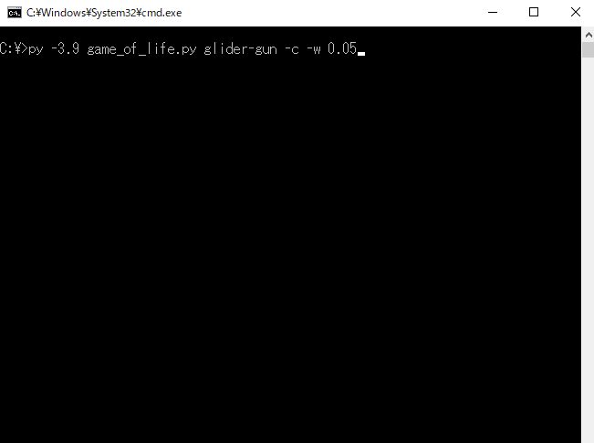
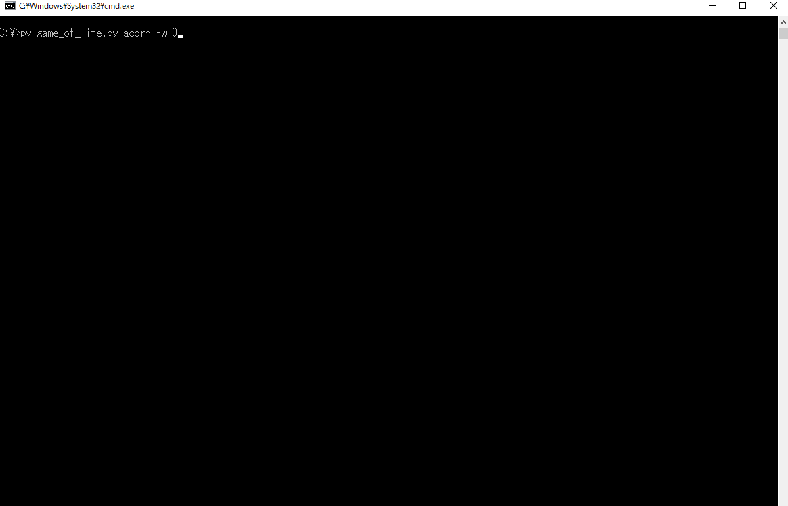

# game_of_life
Pythonで作ったコンソール上で動くライフゲーム

## 説明記事
### Pythonで作ったコンソール上で動くライフゲーム
https://qiita.com/y-tetsu/items/264d263717f933ad3cb2

### Pythonで作ったコンソール上で動くライフゲーム#2
https://qiita.com/y-tetsu/items/2db7ce8dd2f8884c2028

## インストール
```
pip install numpy
pip install opencv-python
```

## デモ
### ランダム


```
py game_of_life.py
```

### 振動子
#### 八角形


```
py game_of_life.py octagon
```

#### 銀河


```
py game_of_life.py galaxy
```

### 移動物体
#### グライダー


```
py game_of_life.py glider
```

#### 軽量級宇宙船


```
py game_of_life.py l-spaceship
```

### 繁殖型
#### ブリーダー1


```
py game_of_life.py breeder1 -d 2
```

#### ブリーダー2


```
py game_of_life.py breeder2 -d 2
```

#### グライダー銃


```
py game_of_life.py glider-gun -c -w 0.05
```

### 長寿型
#### ダイハード


```
py game_of_life.py die-hard
```

#### どんぐり


```
py game_of_life.py acorn -w 0
```

#### ノアの方舟


```
py game_of_life.py noahs-ark -d 0.5 -w 0 -c2
```

### エデンの園配置
#### エデンの園(1971年)


```
py game_of_life.py eden1971 -d 2 -w 0.5
```
