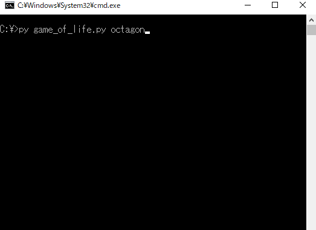
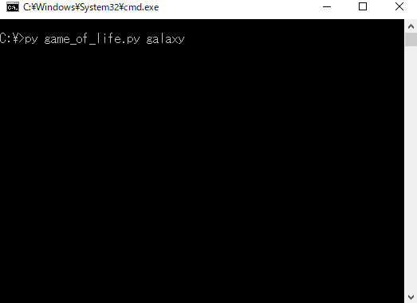
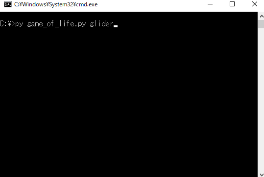
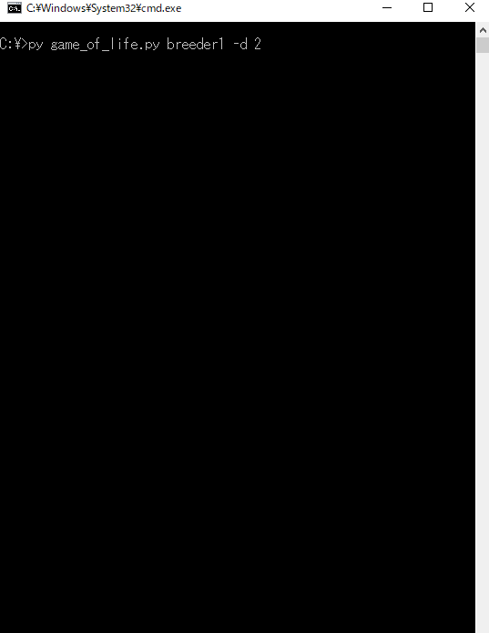
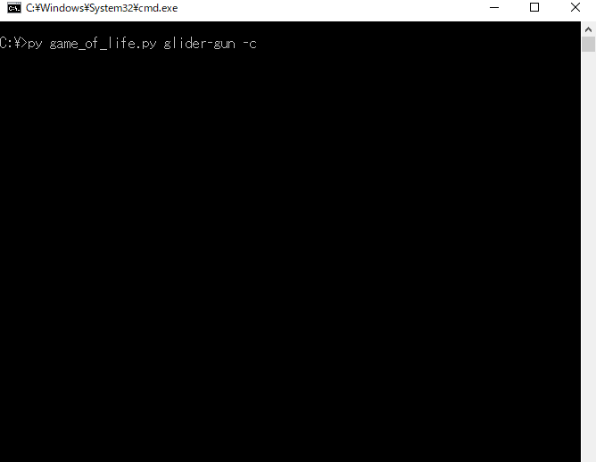

# game_of_life
Pythonで作ったCLIで動くライフゲーム

## 説明
https://qiita.com/y-tetsu/items/264d263717f933ad3cb2

## デモ
### ランダム


```
py game_of_life.py
```

### 振動子
#### 八角形


```
py game_of_life.py octagon
```

#### 銀河


```
py game_of_life.py galaxy
```

### 移動物体
#### グライダー


```
py game_of_life.py glider
```

#### 軽量級宇宙船


```
py game_of_life.py l-spaceship
```

### 繁殖型
#### ブリーダー1


```
py game_of_life.py breeder1 -d 2
```

#### ブリーダー2


```
py game_of_life.py breeder2 -d 2
```

#### グライダー銃


```
py game_of_life.py glider-gun -c
```

### 長寿型
#### ダイハード


```
py game_of_life.py die-hard
```

### エデンの園配置型
#### エデンの園(1971年)


```
py game_of_life.py eden1971 -d 2 -w 0.5
```
